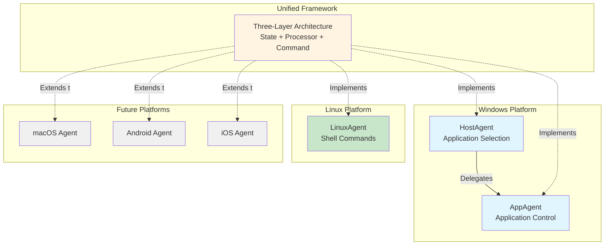
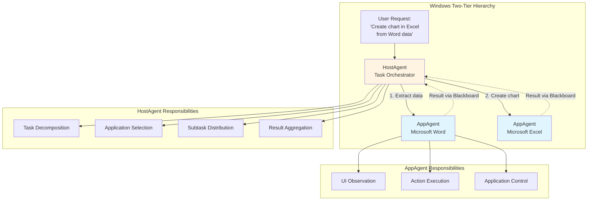
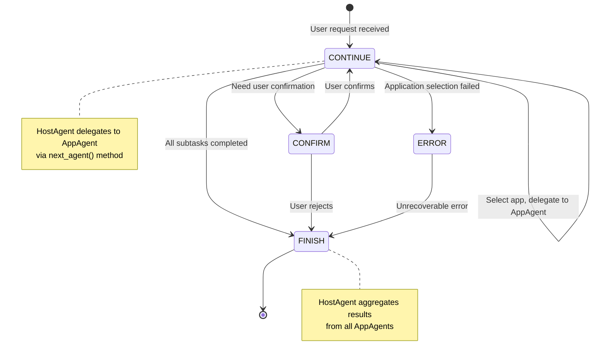
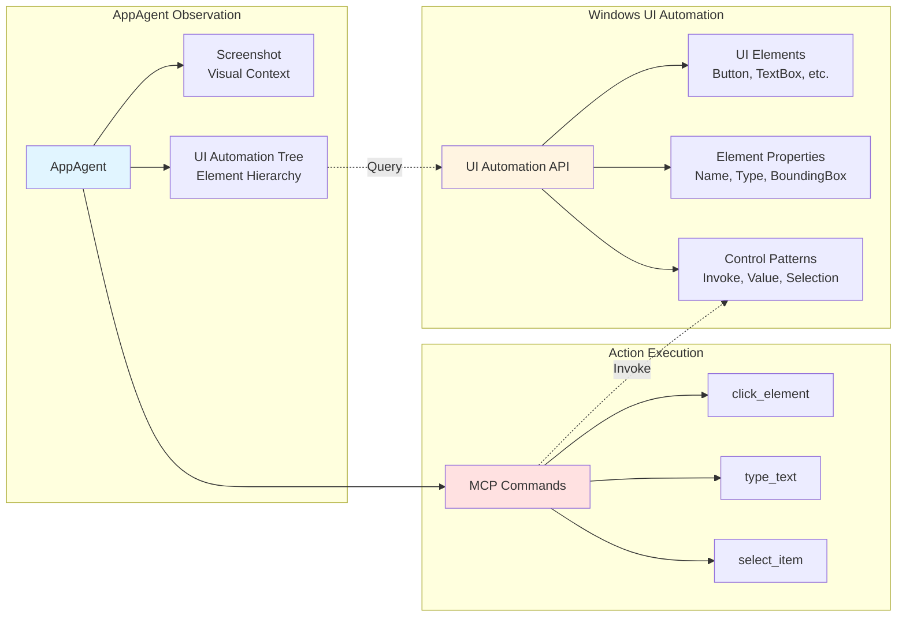
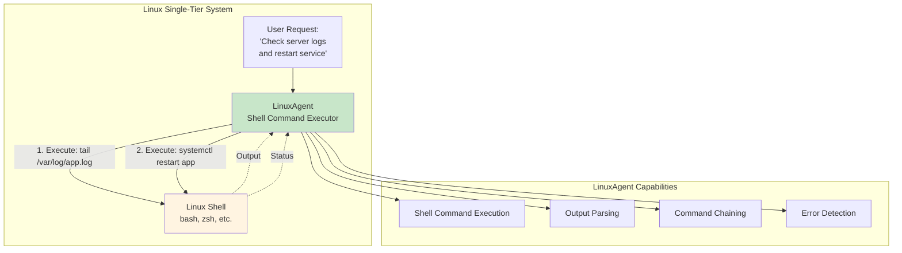
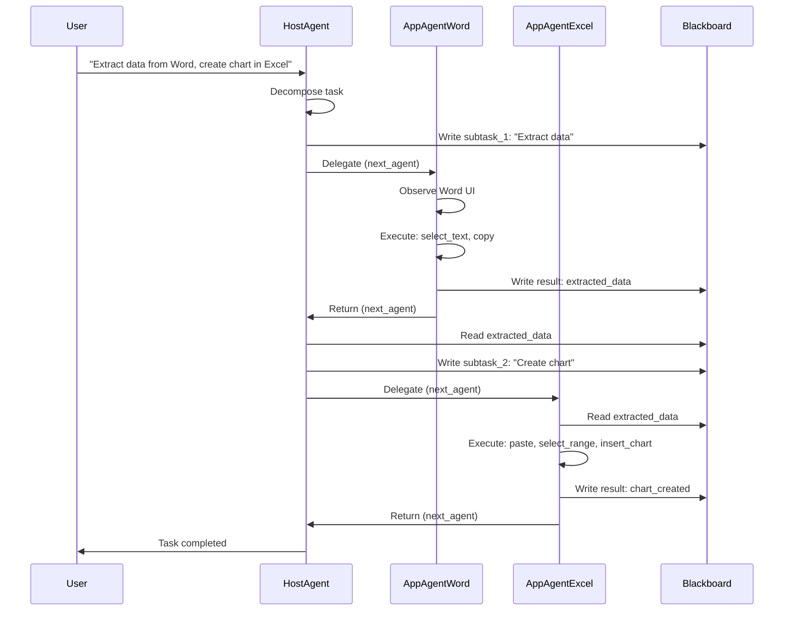
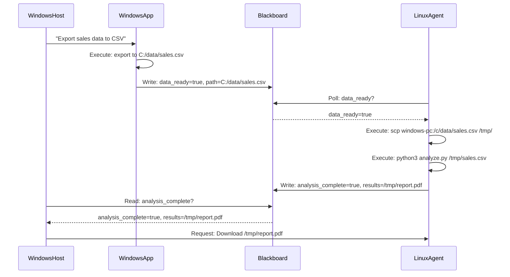
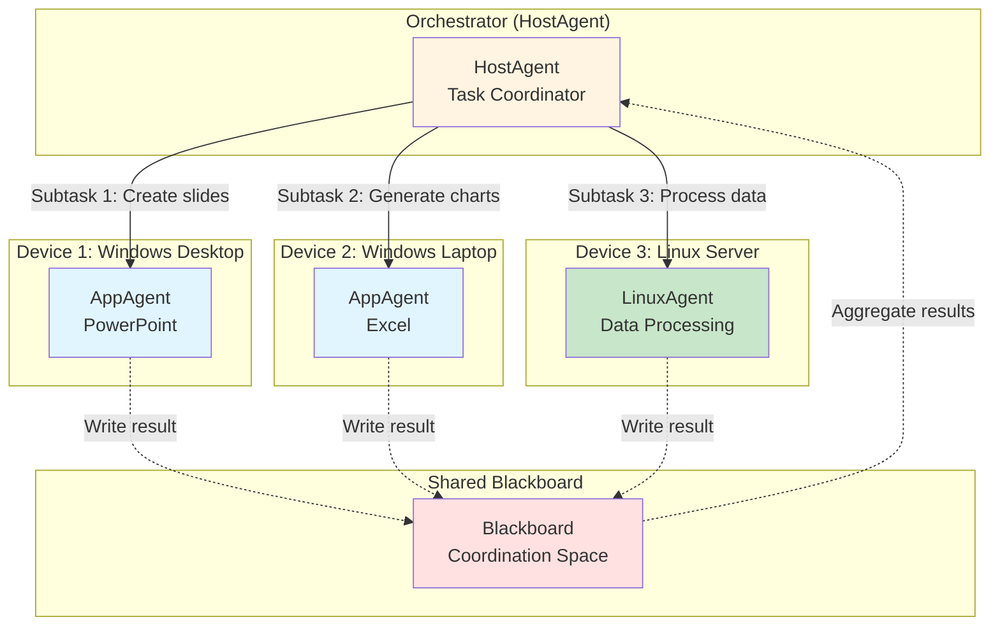
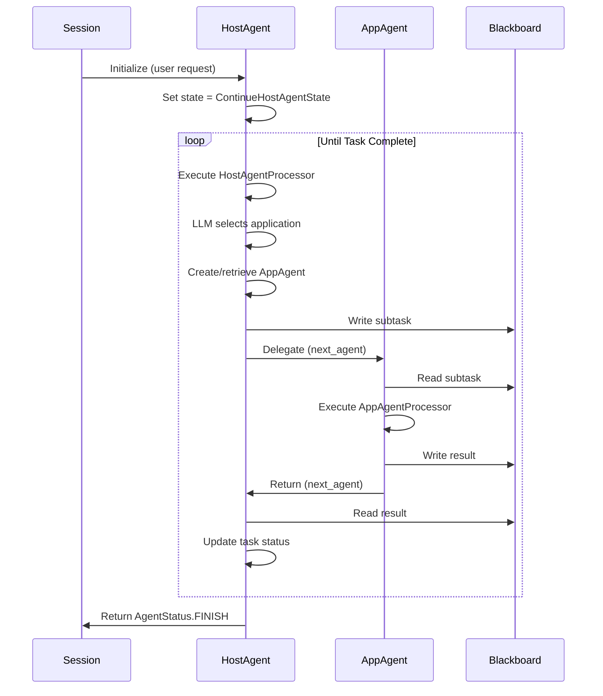
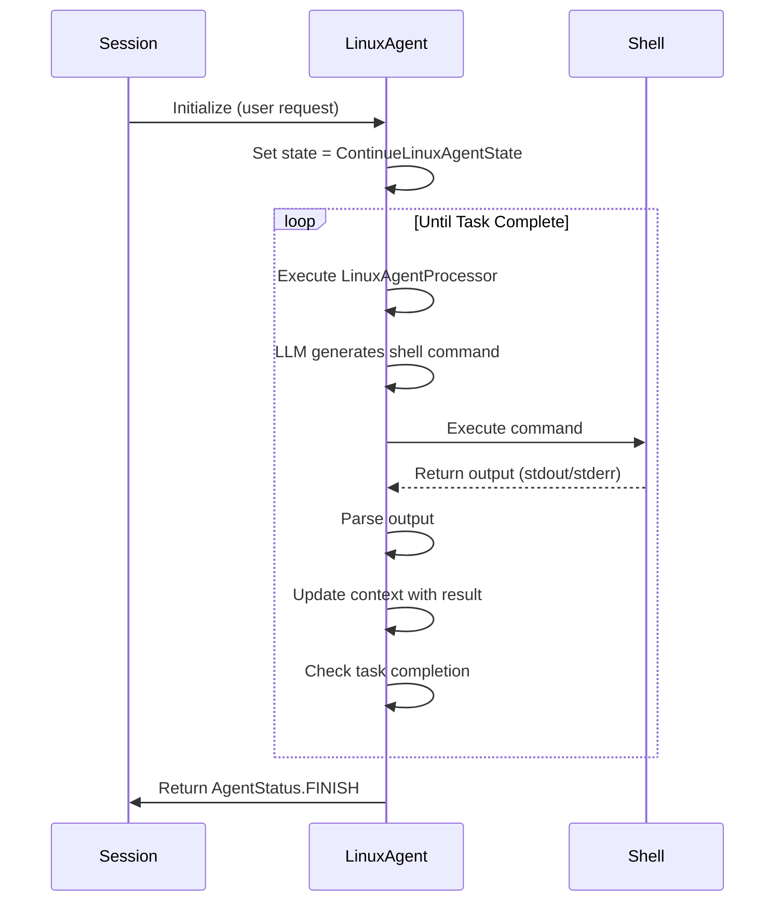

# 平台特定的 Agent 实现

本文档说明统一的三层 Device Agent 架构如何在不同平台上实现。虽然核心框架（State、Processor、Command 三层）保持一致，但每个平台都会实现针对其原生控制机制和层级结构优化的专用 Agent。理解这些实现，对于将 UFO3 扩展到新平台或自定义现有 Agent 非常重要。

## 概览

UFO3 的 Device Agent 架构通过**平台特定的 Agent 实现**来获得跨平台兼容性。这些 Agent 继承自共同的抽象框架。每个平台的 Agent 都实现同一个 `BasicAgent` 接口，同时根据自身执行环境的特点适配三层架构：



**统一框架的优势：**

- **代码复用**：状态管理、策略编排和命令分发逻辑可以在不同平台之间共享。
- **接口一致**：所有 Agent 都实现 `BasicAgent` 接口，具备相同的生命周期，例如 `handle`、`next_state`、`next_agent`。
- **可扩展性**：新平台可以继承三层架构，只需要实现平台特定的策略与命令。
- **多平台协同**：Windows 上的 HostAgent 可以通过 Blackboard 与 Linux 设备上的 LinuxAgent 协同。

---

## 平台对比

| 特性 | Windows（双层架构） | Linux（单层架构） | 未来平台（macOS、移动端） |
|---------|-------------------|---------------------|------------------------|
| **Agent 层级结构** | HostAgent → AppAgent 委派 | LinuxAgent（扁平结构） | 平台特定，待定 |
| **观察方式** | UI Automation API（COM） | Shell 输出、可访问性树 | 平台 API（Accessibility、Screen） |
| **动作机制** | UI 元素操作（点击、输入） | Shell 命令执行 | 平台特定控制方式 |
| **应用模型** | 窗口化应用 | 命令行工具、X11 应用 | 应用框架 |
| **状态复杂度** | 7 种状态（CONTINUE、FINISH、CONFIRM 等） | 简化状态集合 | 取决于平台 |
| **多 Agent 协同** | HostAgent → AppAgent 通过 Blackboard 协同 | 不适用（每个设备一个单 Agent） | 通过 Blackboard 跨设备协同 |
| **主要使用场景** | Office 自动化、GUI 应用 | 服务器管理、DevOps | 移动应用、嵌入式系统 |

!!! info "平台选择策略"
    - **Windows**：对于需要多步骤工作流的 GUI 应用任务，使用 HostAgent + AppAgent，例如 Excel 数据分析、Word 文档编辑。
    - **Linux**：对于命令行任务、服务器管理、脚本工作流，使用 LinuxAgent。
    - **跨平台**：对于混合任务，通过 Blackboard 协调 Windows 和 Linux Agent，例如 Windows 收集数据、Linux 在服务器上处理数据。

---

## Windows 平台：双层 Agent 层级结构

Windows 采用**双层层级结构**。HostAgent 负责应用选择和任务分解，然后将执行委派给面向特定应用的 AppAgent 实例。

### 架构概览



**双层执行流程示例：**

**用户请求**："Extract data from sales.docx and create a bar chart in Excel"

**HostAgent**：
1. 分析请求 → 判断需要使用 Word 和 Excel。
2. 创建子任务 1："Extract sales data from Word document"。
3. 通过 `next_agent()` 委派给 AppAgent（Word）。

**AppAgent（Word）**：
1. 观察 Word UI，定位销售数据表。
2. 执行 `select_text` + `copy_to_clipboard` 动作。
3. 将结果写入 Blackboard：`blackboard.add_data(data, blackboard.trajectories)`。
4. 通过 `next_agent(HostAgent)` 返回 HostAgent。

**HostAgent**：
1. 从 Blackboard 读取结果。
2. 创建子任务 2："Create bar chart in Excel from extracted data"。
3. 通过 `next_agent()` 委派给 AppAgent（Excel）。

**AppAgent（Excel）**：
1. 从 Blackboard trajectories 中读取数据。
2. 执行动作：`paste_data` → `select_data_range` → `insert_chart`。
3. 以 `AgentStatus.FINISH` 返回 HostAgent。

---

## HostAgent：应用选择与任务编排

**HostAgent** 是 Windows 双层层级结构中的顶层协调器，负责**应用选择**、**任务分解**和**子任务分发**。

### HostAgent 架构

```python
@AgentRegistry.register(agent_name="hostagent")
class HostAgent(BasicAgent):
    """
    The HostAgent class is the manager of AppAgents.
    Coordinates multi-application workflows on Windows.
    """
    
    def __init__(
        self,
        name: str,
        is_visual: bool,
        main_prompt: str,
        example_prompt: str,
        api_prompt: str,
    ) -> None:
        super().__init__(name=name)
        self.prompter = HostAgentPrompter(is_visual, main_prompt, example_prompt, api_prompt)
        self.agent_factory = AgentFactory()
        self.appagent_dict = {}  # Cache of created AppAgent instances
        self._active_appagent = None
        self._blackboard = Blackboard()  # Shared coordination space
        self.set_state(self.default_state)
```

### 核心职责

| 职责 | 实现方式 | 示例 |
|----------------|----------------|---------|
| **任务分解** | LLM 分析用户请求，并拆分为子任务 | "Create report" → ["Extract data", "Generate chart", "Format document"] |
| **应用选择** | 为每个子任务识别所需应用 | 子任务 "Extract data" → Microsoft Word |
| **AppAgent 创建** | 使用工厂模式按需创建 AppAgent 实例 | `agent_factory.create_agent("app", process="WINWORD.EXE")` |
| **子任务委派** | 将子任务路由给合适的 AppAgent | `next_agent()` → AppAgent(Word) |
| **结果聚合** | 通过 Blackboard 收集 AppAgent 结果 | `blackboard.get_value("appagent/word/result")` |
| **多应用协同** | 按顺序协调多个应用之间的动作 | Word → Excel → PowerPoint 工作流 |

### HostAgent Processor

```python
class HostAgentProcessor(ProcessorTemplate):
    """
    Processor for HostAgent with specialized strategies.
    """
    
    def __init__(self, agent, context):
        super().__init__(agent, context)
        
        # DATA_COLLECTION: Get list of running applications
        self.register_strategy(
            ProcessingPhase.DATA_COLLECTION,
            HostDataCollectionStrategy(agent, context)
        )
        
        # LLM_INTERACTION: Application selection and task planning
        self.register_strategy(
            ProcessingPhase.LLM_INTERACTION,
            HostLLMInteractionStrategy(agent, context)
        )
        
        # ACTION_EXECUTION: Create AppAgent, delegate subtask
        self.register_strategy(
            ProcessingPhase.ACTION_EXECUTION,
            HostActionExecutionStrategy(agent, context)
        )
```

**HostAgent 的策略特化：**

- **DATA_COLLECTION**：使用 MCP 工具观察可用的 Windows 应用。
- **LLM_INTERACTION**：使用专门的 prompt 模板完成应用选择：
    - 输入：用户请求 + 正在运行的应用列表。
    - 输出：被选中的应用 + 分解后的子任务。
- **ACTION_EXECUTION**：不直接执行 UI 命令，而是创建或获取 AppAgent 实例，并通过 `next_agent()` 进行委派。

### HostAgent 状态转移



**HostAgent 委派模式示例：**

```python
class HostAgent(BasicAgent):
    def handle(self, context: Context) -> Tuple[AgentStatus, Optional[BasicAgent]]:
        """
        Handle HostAgent state: select application and delegate.
        """
        # Execute processor strategies
        processor = HostAgentProcessor(self, context)
        result = processor.process()
        
        # Get selected application from LLM response
        selected_app = result.parsed_response.get("application")
        subtask = result.parsed_response.get("subtask")
        
        # Create or retrieve AppAgent for selected application
        appagent = self.get_or_create_appagent(selected_app)
        
        # Write subtask to Blackboard for AppAgent to read
        self._blackboard.add_data(
            {"subtask": subtask, "app": selected_app},
            self._blackboard.requests
        )
        
        # Delegate to AppAgent
        return AgentStatus.CONTINUE, appagent
    
    def get_or_create_appagent(self, app_name: str) -> AppAgent:
        """
        Factory method: Create AppAgent if not exists, otherwise return cached instance.
        """
        if app_name not in self.appagent_dict:
            self.appagent_dict[app_name] = self.agent_factory.create_agent(
                agent_type="app",
                name=f"AppAgent/{app_name}",
                process_name=app_name,
                app_root_name=app_name
            )
        return self.appagent_dict[app_name]
```

---

## AppAgent：特定应用控制

**AppAgent** 负责**直接控制某个特定 Windows 应用**，并通过 Windows UI Automation API 执行基于 UI 的动作。

### AppAgent 架构

```python
@AgentRegistry.register(agent_name="appagent", processor_cls=AppAgentProcessor)
class AppAgent(BasicAgent):
    """
    The AppAgent class manages interaction with a specific Windows application.
    """
    
    def __init__(
        self,
        name: str,
        process_name: str,
        app_root_name: str,
        is_visual: bool,
        main_prompt: str,
        example_prompt: str,
        mode: str = "normal",
    ) -> None:
        super().__init__(name=name)
        self.prompter = AppAgentPrompter(is_visual, main_prompt, example_prompt)
        self._process_name = process_name  # e.g., "WINWORD.EXE"
        self._app_root_name = app_root_name  # e.g., "Microsoft Word"
        self._mode = mode
        self.set_state(self.default_state)
```

### 核心职责

| 职责 | 实现方式 | 示例 |
|----------------|----------------|---------|
| **UI 观察** | 截图 + UI Automation 树捕获 | `get_ui_tree` 返回层级化元素结构 |
| **元素识别** | 解析 UI 树以定位目标元素 | 根据名称、控件类型、边界框查找 "Save" 按钮 |
| **动作执行** | 通过 MCP 工具执行 UI 命令 | `click_element(element_id="save_button")` |
| **应用上下文** | 维护应用特定状态 | 当前文档、活动窗口、焦点元素 |
| **错误处理** | 检测并从 UI 失败中恢复 | 遇到陈旧元素时重试，或回退到键盘快捷键 |
| **结果报告** | 将结果写入 Blackboard 给 HostAgent | `blackboard.add_key_value("result", "Document saved")` |

### AppAgent Processor

```python
class AppAgentProcessor(ProcessorTemplate):
    """
    Processor for AppAgent with UI-focused strategies.
    """
    
    def __init__(self, agent, context):
        super().__init__(agent, context)
        
        # DATA_COLLECTION: Screenshot + UI tree
        self.register_strategy(
            ProcessingPhase.DATA_COLLECTION,
            ComposedStrategy([
                ScreenshotStrategy(agent, context),
                UITreeStrategy(agent, context)
            ])
        )
        
        # LLM_INTERACTION: UI element selection
        self.register_strategy(
            ProcessingPhase.LLM_INTERACTION,
            AppAgentLLMStrategy(agent, context)
        )
        
        # ACTION_EXECUTION: Execute UI commands
        self.register_strategy(
            ProcessingPhase.ACTION_EXECUTION,
            UIActionExecutionStrategy(agent, context)
        )
```

### Windows UI Automation 集成

AppAgent 借助 **Windows UI Automation（UIA）** 实现更稳健的 UI 控制：



**UI Automation 能力：**

- **元素发现**：遍历 UI 树，根据名称、类型、Automation ID 查找控件。
- **属性访问**：读取元素属性，例如文本、状态、位置、可见性。
- **Pattern 调用**：执行控件特定动作：
    - InvokePattern：点击按钮、菜单项。
    - ValuePattern：设置文本框文本。
    - SelectionPattern：选择列表或下拉框中的项目。
    - TogglePattern：切换复选框、单选按钮。

### AppAgent 命令

| 命令类别 | 命令 | 说明 |
|-----------------|----------|-------------|
| **观察** | `screenshot`, `get_ui_tree`, `get_accessibility_tree` | 捕获视觉信息和结构化 UI 信息 |
| **导航** | `click_element`, `double_click`, `right_click` | 通过鼠标交互导航 UI |
| **文本输入** | `type_text`, `set_value`, `clear_text` | 在 UI 控件中输入和修改文本 |
| **选择** | `select_item`, `select_dropdown`, `toggle_checkbox` | 操作选择类控件 |
| **滚动** | `scroll`, `scroll_to_element` | 在较大的 UI 区域中导航 |
| **窗口管理** | `activate_window`, `close_window`, `maximize_window` | 控制窗口状态 |
| **文件操作** | `open_file`, `save_file`, `save_as` | 应用特定的文件动作 |

**AppAgent UI 控制模式示例：**

```python
class AppAgent(BasicAgent):
    def handle(self, context: Context) -> Tuple[AgentStatus, Optional[BasicAgent]]:
        """
        Handle AppAgent state: Control application UI.
        """
        # Read subtask from Blackboard (written by HostAgent)
        subtask_memory = self._blackboard.requests.to_list_of_dicts()
        if subtask_memory:
            subtask = subtask_memory[-1].get("subtask")
        
        # Execute processor strategies
        processor = AppAgentProcessor(self, context)
        context.set(ContextNames.REQUEST, subtask)
        result = processor.process()
        
        # Check if subtask completed
        if result.status == AgentStatus.FINISH:
            # Write result to Blackboard
            self._blackboard.add_data(
                {"result": result.parsed_response.get("result")},
                self._blackboard.trajectories
            )
            
            # Return to HostAgent
            return AgentStatus.FINISH, self.parent_agent
        
        return result.status, None
```

---

## Linux 平台：单层 Agent 系统

Linux 采用**单层架构**，LinuxAgent 直接执行 shell 命令，不进行层级委派。

### LinuxAgent 架构



```python
@AgentRegistry.register(
    agent_name="LinuxAgent",
    third_party=True,
    processor_cls=LinuxAgentProcessor
)
class LinuxAgent(CustomizedAgent):
    """
    LinuxAgent is a specialized agent that interacts with Linux systems.
    Executes shell commands and parses output.
    """
    
    def __init__(
        self,
        name: str,
        main_prompt: str,
        example_prompt: str,
    ) -> None:
        super().__init__(
            name=name,
            main_prompt=main_prompt,
            example_prompt=example_prompt,
            process_name=None,
            app_root_name=None,
            is_visual=None  # LinuxAgent typically operates without visual mode
        )
        self._blackboard = Blackboard()
        self.set_state(ContinueLinuxAgentState())
```

### 与 Windows Agent 的核心差异

| 维度 | Windows（HostAgent + AppAgent） | Linux（LinuxAgent） |
|--------|--------------------------------|-------------------|
| **层级结构** | 双层结构（委派模式） | 单层结构（直接执行） |
| **观察方式** | 截图 + UI Automation 树 | Shell 命令输出（stdout/stderr） |
| **动作机制** | UI 元素操作 | Shell 命令执行 |
| **上下文跟踪** | 应用窗口、UI 状态 | 命令历史、工作目录 |
| **错误检测** | UI 元素未找到、超时 | 退出码不为 0、stderr 输出 |
| **协同方式** | HostAgent 和 AppAgent 之间通过 Blackboard 协同 | 通过 Blackboard 与其他设备跨设备协同 |

### LinuxAgent Processor

```python
class LinuxAgentProcessor(ProcessorTemplate):
    """
    Processor for LinuxAgent with shell-focused strategies.
    """
    
    def __init__(self, agent, context):
        super().__init__(agent, context)
        
        # DATA_COLLECTION: No visual observation, use command output from previous step
        self.register_strategy(
            ProcessingPhase.DATA_COLLECTION,
            LinuxDataCollectionStrategy(agent, context)  # Collects shell output
        )
        
        # LLM_INTERACTION: Command generation from request
        self.register_strategy(
            ProcessingPhase.LLM_INTERACTION,
            LinuxLLMStrategy(agent, context)  # Generates shell commands
        )
        
        # ACTION_EXECUTION: Execute shell commands
        self.register_strategy(
            ProcessingPhase.ACTION_EXECUTION,
            ShellExecutionStrategy(agent, context)  # Executes via shell_execute
        )
```

### LinuxAgent 命令

| 命令 | 功能 | 示例 |
|---------|----------|---------|
| `shell_execute` | 执行 shell 命令（非阻塞） | `shell_execute(command="ls -la /home/user")` |
| `shell_execute_read` | 执行命令并捕获输出 | `shell_execute_read(command="cat /var/log/app.log")` |
| `get_accessibility_tree` | 获取 GUI 应用的可访问性树（X11） | 对 GUI 应用调用 `get_accessibility_tree()` |
| `screenshot` | 截屏（可选，用于 GUI） | `screenshot()` |

**LinuxAgent 最佳实践：**

- **命令链式执行**：使用 `&&` 和 `||` 构建更稳健的工作流：
    ```bash
    cd /app && ./deploy.sh || echo "Deployment failed"
    ```
- **输出解析**：从 stdout 中解析结构化数据：
    ```python
    output = shell_execute_read("systemctl status app")
    if "active (running)" in output:
        # Service is running
    ```
- **错误处理**：检查退出码与 stderr：
    ```python
    result = shell_execute("restart_service.sh")
    if result.status == ResultStatus.FAILURE:
        # Handle error from stderr
    ```
- **幂等性**：设计可以安全重复运行的命令：
    ```bash
    # Good: Check before creating
    [ -d /app/backup ] || mkdir -p /app/backup
    
    # Bad: Fails if directory exists
    mkdir /app/backup
    ```

**LinuxAgent 跨设备协同示例：**

```python
# Windows HostAgent prepares data for Linux processing
windows_blackboard.add_data(
    {"data_file": "C:/export/data.csv", "ready": True},
    windows_blackboard.requests
)

# LinuxAgent polls Blackboard for task availability
requests = linux_blackboard.requests.to_list_of_dicts()
if requests and requests[-1].get("ready"):
    # Download data from Windows device (via network share or AIP)
    await linux_agent.execute_command(
        "scp user@windows-pc:/c/export/data.csv /tmp/data.csv"
    )
    
    # Process data
    await linux_agent.execute_command(
        "python3 /app/process.py /tmp/data.csv"
    )
    
    # Report completion
    linux_blackboard.add_data(
        {"status": "completed"},
        linux_blackboard.trajectories
    )
```

---

## 多 Agent 协同模式

三层架构通过**基于 Blackboard 的通信**实现不同 Agent 类型之间的无缝协同。

### 模式 1：Windows 多应用工作流



### 模式 2：Linux-Windows 跨设备协同



### 模式 3：并行多设备任务



---

## 平台可扩展性：添加新平台

三层架构为 UFO3 扩展到新平台提供了清晰路径。

### 扩展检查清单

**添加新平台的步骤：**

1. **定义 Agent 类**
    ```python
    @AgentRegistry.register(
        agent_name="MacOSAgent",
        processor_cls=MacOSAgentProcessor
    )
    class MacOSAgent(BasicAgent):
        # Implement platform-specific initialization
    ```

2. **实现平台特定策略**
    - **DATA_COLLECTION**：如何观察系统状态，例如截图、可访问性树、shell 输出。
    - **LLM_INTERACTION**：根据平台能力调整 prompt 模板。
    - **ACTION_EXECUTION**：将动作映射到平台 API，例如 AppKit、Accessibility API 等。
    - **MEMORY_UPDATE**：通常使用标准实现，一般不需要改动。

3. **定义平台命令（MCP Tools）**
    ```python
    # macOS-specific commands
    commands = [
        "applescript_execute",  # Execute AppleScript
        "accessibility_tree",   # macOS Accessibility API
        "click_element",        # macOS UI control
        "type_text"             # Text input
    ]
    ```

4. **实现 AgentState 子类**（如有需要）
    ```python
    class ContinueMacOSAgentState(AgentState):
        def handle(self, agent, context):
            # macOS-specific state handling
    ```

5. **创建平台特定 Processor**
    ```python
    class MacOSAgentProcessor(ProcessorTemplate):
        def __init__(self, agent, context):
            super().__init__(agent, context)
            self.register_strategy(
                ProcessingPhase.DATA_COLLECTION,
                MacOSDataCollectionStrategy(agent, context)
            )
            # Register other strategies...
    ```

6. **配置 MCP Server**（在设备客户端上）
    - 实现平台特定操作对应的 MCP 工具。
    - 将工具注册到 MCP server manager。
    - 确保 AIP client 能正确路由命令。

### 平台特定注意事项

| 平台 | 关键注意事项 | 建议实现 |
|----------|-------------------|--------------------------|
| **macOS** | Accessibility API、AppleScript、窗口管理 | MacOSAgent（单层），AppleScript 执行策略 |
| **Android** | Activity 生命周期、UI Automator、触控手势 | AndroidAgent（单层），UI Automator 集成 |
| **iOS** | Accessibility、XCTest、自动化能力受限 | iOSAgent（单层），XCTest 框架 |
| **Embedded** | 资源有限、无 GUI、只支持命令行 | EmbeddedAgent（最小策略，基于 shell） |
| **Web** | 浏览器自动化、DOM 操作 | WebAgent（Selenium / Playwright 集成） |

**示例：添加 macOS 支持**

```python
# 1. Define macOS Agent
@AgentRegistry.register(
    agent_name="MacOSAgent",
    processor_cls=MacOSAgentProcessor
)
class MacOSAgent(BasicAgent):
    def __init__(self, name: str, main_prompt: str, example_prompt: str):
        super().__init__(name=name)
        self.prompter = MacOSAgentPrompter(main_prompt, example_prompt)
        self.set_state(ContinueMacOSAgentState())

# 2. Implement macOS-specific DATA_COLLECTION strategy
class MacOSDataCollectionStrategy(ProcessingStrategy):
    def execute(self, context: ProcessingContext):
        # Use macOS Accessibility API
        commands = [
            Command(tool_name="get_accessibility_tree", parameters={}, tool_type="data_collection"),
            Command(tool_name="screenshot", parameters={}, tool_type="data_collection")
        ]
        results = self.dispatcher.execute_commands(commands)
        
        context.set_local("accessibility_tree", results[0].result)
        context.set_local("screenshot", results[1].result)

# 3. Implement macOS-specific ACTION_EXECUTION strategy
class MacOSActionExecutionStrategy(ProcessingStrategy):
    def execute(self, context: ProcessingContext):
        action = context.get_global("action")
        
        if action == "click_element":
            # Use macOS Accessibility API via MCP tool
            command = Command(
                tool_name="macos_click_element",
                parameters={"element_id": context.get_global("element_id")},
                tool_type="action"
            )
        elif action == "applescript_execute":
            # Execute AppleScript via MCP tool
            command = Command(
                tool_name="applescript_execute",
                parameters={"script": context.get_global("applescript")},
                tool_type="action"
            )
        
        results = self.dispatcher.execute_commands([command])
        context.set_local("execution_results", results)

# 4. Configure MCP tools on macOS device client
# In device client code:
mcp_server_manager.register_tool(
    MCPToolInfo(
        tool_name="macos_click_element",
        description="Click element via macOS Accessibility API",
        input_schema={
            "element_id": {"type": "string", "description": "Accessibility element ID"}
        },
        # ... other fields
    ),
    handler=macos_accessibility_click_handler
)
```

---

## Agent 生命周期对比

### Windows HostAgent 生命周期



### Linux LinuxAgent 生命周期



---

## 性能与可扩展性

| 指标 | Windows（双层架构） | Linux（单层架构） | 说明 |
|--------|-------------------|---------------------|-------|
| **Agent 初始化** | 约 500ms（HostAgent）+ 每个 AppAgent 约 300ms | 约 200ms（LinuxAgent） | 每个应用创建 AppAgent 会带来额外开销 |
| **观察延迟** | 约 1–2s（截图 + UI 树） | 约 100–500ms（shell 输出） | UI Automation API 比 shell 慢 |
| **动作执行** | 每个 UI 动作约 200–500ms | 每个 shell 命令约 50–200ms | UI 动作需要元素发现 |
| **内存占用** | 约 50MB（HostAgent）+ 每个 AppAgent 约 30MB | 约 20MB（LinuxAgent） | UI Automation 会增加内存使用 |
| **可扩展性** | 受 AppAgent 数量限制 | 可处理大量并行命令 | HostAgent 管理 AppAgent 池 |
| **协同开销** | 每次委派都需要 Blackboard 读写 | 很小（只有跨设备时需要） | 双层层级会增加通信 |

**性能优化：**

- **Windows**：在不同子任务之间复用 AppAgent 实例，它们缓存在 `appagent_dict` 中。
- **Linux**：使用 `&&` 批处理多个 shell 命令，减少往返次数。
- **跨平台**：尽量减少 Blackboard 写入；使用层级化 key 提高读取效率。

---

## 最佳实践

### Windows Agent 最佳实践

**HostAgent：**

- **AppAgent 缓存**：对同一个应用复用 AppAgent 实例，避免重复创建开销。
- **任务分解**：将复杂任务拆分为独立子任务，以便并行执行。
- **Blackboard 命名空间**：在合适的 memory section 中使用清晰的 key。
- **错误传播**：检测 AppAgent 失败，并用不同策略重试。

**AppAgent：**

- **元素稳定性**：交互前等待 UI 元素稳定，例如使用 `wait_for_element`。
- **回退动作**：如果 UI Automation 失败，回退到键盘快捷键，例如用 Ctrl+S 替代点击 Save 按钮。
- **上下文感知**：跟踪活动窗口和焦点，确保动作作用于正确应用。
- **动作幂等性**：将动作设计为可安全重试，例如创建文件前先检查文件是否存在。

### Linux Agent 最佳实践

**LinuxAgent：**

- **命令校验**：执行前校验命令，防止命令注入攻击。
- **输出解析**：使用 JSON、CSV 等结构化输出，而不是解析原始文本。
- **错误检测**：检查退出码（`$?`）和 stderr 判断失败。
- **幂等性**：使用条件命令（`[ -f file ] || create_file`）安全重复运行工作流。
- **资源清理**：任务完成后始终清理临时文件和进程。

### 跨平台最佳实践

**多 Agent 协同：**

- **Blackboard Key**：使用合适的 memory section 区分 Agent 特定数据：
    ```python
    # Good - using structured memory sections
    blackboard.add_data({"status": "ready"}, blackboard.requests)
    blackboard.add_data({"status": "processing"}, blackboard.trajectories)
    
    # Bad - unclear categorization
    blackboard.add_data({"status": "ready"}, blackboard.questions)
    ```

- **同步机制**：使用轮询或事件驱动模式进行跨设备同步：
    ```python
    # Polling pattern
    while not any(r.get("task_complete") for r in blackboard.requests.to_list_of_dicts()):
        await asyncio.sleep(1)
    
    # Event-based (via AIP custom messages)
    # Linux device sends completion event
    aip_client.send_event("task_complete", {...})
    ```

- **数据传输**：对于大数据，使用共享存储（网络驱动器、S3），不要直接写入 Blackboard：
    ```python
    # Bad: Store large data in Blackboard
    blackboard.add_data({"dataset": [1000000 rows]}, blackboard.trajectories)
    
    # Good: Store reference to shared storage
    blackboard.add_data({"dataset_path": "s3://bucket/data.csv"}, blackboard.requests)
    ```

---

## 相关文档

- [Device Agent Overview](overview.md) - 三层架构和设计原则
- [Server-Client Architecture](server_client_architecture.md) - Server 与 Client 分离
- [State Layer](design/state.md) - AgentState 接口和状态机
- [Processor and Strategy Layer](design/processor.md) - ProcessorTemplate 和策略实现
- [Command Layer](design/command.md) - CommandDispatcher 和 MCP 集成
- [Memory System](design/memory.md) - 用于 Agent 协同的 Memory 和 Blackboard
- [Server Architecture](../../server/overview.md) - Server 端编排
- [Client Architecture](../../client/overview.md) - 设备客户端 MCP 执行
- [AIP Protocol](../../aip/overview.md) - 用于通信的 Agent Interaction Protocol

---

## 总结

**关键要点：**

- **Windows 双层层级结构**：HostAgent 负责编排，AppAgent 负责应用控制，适合 GUI 工作流。
- **Linux 单层系统**：LinuxAgent 直接执行 shell 命令，适合命令行任务。
- **统一框架**：两个平台都利用同一套三层架构，即 State、Processor、Command。
- **多 Agent 协同**：Blackboard 支持 HostAgent → AppAgent 以及跨设备通信的无缝协同。
- **平台可扩展性**：为 macOS、Android、iOS、嵌入式系统等提供清晰扩展路径。
- **HostAgent 职责**：任务分解、应用选择、AppAgent 创建、子任务委派。
- **AppAgent 能力**：UI 观察（截图 + UI Automation）、元素识别、UI 动作执行。
- **LinuxAgent 特点**：shell 命令执行、输出解析、幂等工作流。
- **最佳实践**：AppAgent 缓存、合理使用 Blackboard、幂等命令、结构化输出解析。
- **性能特征**：Windows UI Automation 较慢但更稳健；Linux shell 命令更快但结构化程度较低。

UFO3 的平台特定 Agent 实现展示了三层架构的灵活性和可扩展性，使系统能够进行跨平台、跨设备的任务自动化，同时保持一致的设计原则与协同机制。
